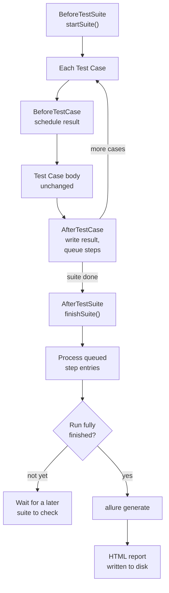
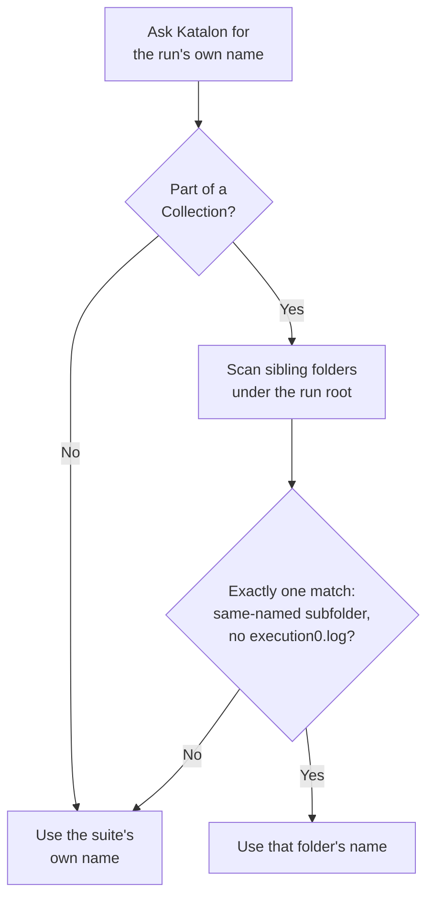

# Architecture

This document explains how the bridge is put together and why the harder
parts work the way they do. It assumes you've read the README's "Why this
exists" table - this goes one level deeper, into the actual mechanics.

## Integration point

Katalon Studio auto-discovers any class under `Test Listeners/` and invokes
methods annotated `@BeforeTestSuite` / `@BeforeTestCase` / `@AfterTestCase` /
`@AfterTestSuite` at the corresponding points in a run. That's the entire
integration surface - no plugin registration, no OSGi bundle, no build step.
`AllureTestListener.groovy` is deliberately thin: four methods, each one
line, delegating straight to `AllureReportBridge`. Katalon's listener
mechanism is the only part of this system Katalon actually has to know
about.

The alternative - a proper Katalon Studio plugin - was ruled out early. A
plugin bundle needs its own OSGi manifest, a compatible build toolchain, and
a publish/install flow through Katalon Store or a manual `.jar` drop into
Katalon's own plugin folder, all of which turns "add Allure reporting" into
a packaging project instead of a five-minute install. Copying source files
into folders Katalon already auto-compiles avoids all of it.

## Lifecycle, end to end



For a single Test Suite, "every suite in this run" is just the one, so the
right branch is taken immediately. For a Test Suite Collection, member
suites can finish in any order and even in separate processes - the left
branch is taken by every member except whichever one happens to finish
last.

## Component layout

```
Test Listeners/AllureTestListener.groovy   Katalon's entry point - pure delegation, no logic
Keywords/allure/AllureReportBridge.groovy  the engine: lifecycle mapping, file I/O, process orchestration
Keywords/allure/AllureConfig.groovy        allure.properties + ALLURE_* env var resolution
Keywords/allure/AllureKeywords.groovy      optional manual API (step/attach/label/...), thin wrapper over Allure's own static methods
```

Everything that matters happens in `AllureReportBridge`. The other three
files exist to keep that one class's job narrow: config reading, keyword
exposure, and Katalon wiring are each separated out rather than folded in.

## Avoiding the dependency clash

Allure's Java client library pulls in its own Jackson version as a
transitive dependency. Katalon Studio already ships a Jackson version of
its own on every project's classpath. Bringing in Allure's client the
normal way (a build tool resolving its full dependency tree) would put two
different Jackson versions on the same classpath, which fails in whichever
order the classloader happens to resolve them.

Only two jars are shipped: `allure-java-commons` and `allure-model`.
`allure-java-commons` relocates its own Jackson dependency into a shaded,
internal package (`io.qameta.allure.internal.shadowed.jackson.*`) rather
than depending on a plain Jackson artifact - confirmed by inspecting the
jar's actual contents, not assumed from its published POM. `slf4j-api`
isn't bundled at all, since Katalon's own classpath already provides a
version that satisfies what `allure-java-commons` needs.

## State across isolated execution phases

Katalon does not run `BeforeTestSuite`, each test case's
`BeforeTestCase`/`AfterTestCase` pair, and `AfterTestSuite` as one
continuous method call sharing a call stack. They're separate phases, and
for a Test Suite Collection, Katalon can run different member suites in
genuinely separate OS processes rather than threads in the same JVM. A
plain static field written in one phase is not guaranteed to be readable in
another.

Anything that needs to survive across phases is written to a small file
under `allure-results/` instead:

- `.allure-run-marker.txt` - which run this is, and the last report path generated for it
- `.allure-pending-steps.txt` - test cases whose step detail still needs parsing
- `.allure-collection-progress.txt` - which sub-suites of the current run have already finished

A couple of static fields still exist (`currentSuiteName`, the intra-JVM
lock object), but only as fallbacks or same-process synchronization
primitives - nothing depends on a static field surviving between phases.

## Locking across processes, not just threads

`withRunLock()` guards every place that reads or mutates the files above.
Because a Test Suite Collection can run member suites as separate OS
processes at the same time, a `synchronized` block alone isn't enough - it
only serializes threads inside one JVM. `withRunLock()` combines two
layers: a `synchronized` block on an in-process lock object, and a real
`FileLock` obtained through `RandomAccessFile`/`FileChannel` on a lock file
in `allure-results/`. The file lock is what actually serializes access
across separate processes; the `synchronized` block exists underneath it
because a second `FileLock` attempt from another thread in the *same* JVM
throws `OverlappingFileLockException` instead of blocking, so something
still has to queue same-JVM threads before they reach the file lock at all.

## Deciding when to generate the report

A Test Suite Collection should produce exactly one combined report, written
once every member suite has finished - not regenerated after each one.
`shouldGenerateReportNow()` determines this by comparing the number of
sub-suites Katalon planned for the run (read once from `plan.jsonl`, when
that file is present) against how many distinct suite instances have
reported themselves complete so far, tracked in
`.allure-collection-progress.txt`.

`plan.jsonl` isn't written by every Katalon Runtime Engine build in every
run mode. When it or the count derived from it isn't available, the
function falls back to returning `true` - generate on every finish. That
fallback is deliberately one-directional: it can only cause the report to
regenerate more often than strictly necessary, never skip the generation
that actually matters. A later suite's `generateHtmlReport()` call always
replaces the previous run's report file rather than adding to it, so
correctness doesn't depend on this optimization firing at all.

## Naming a Test Suite Collection's report

`RunConfiguration.getExecutionSourceName()` is Katalon's public API for the
name of whatever is currently executing, but for a Test Suite Collection it
only ever returns the individual member suite's own name - there is no
public API that hands a Test Listener the enclosing collection's name.

The bridge recovers it from the run's own folder structure instead.
Katalon writes a sibling directory directly under the run's report root,
named after the collection itself, alongside each member suite's own
folder - present before any member suite's `AfterTestSuite` fires. Telling
that folder apart from a member suite's folder takes two conditions
together, not one:

- it has a subfolder named exactly like the run root's own folder (the
  collection's own subfolder always carries the run root's timestamp; a
  member suite's subfolder is timestamped for whenever that suite actually
  started)
- that subfolder does not contain `execution0.log`



Subfolder-name matching alone isn't sufficient on its own: on a fast enough
machine, a member suite can start within the same second the run root
folder was created, so its own subfolder ends up sharing that timestamp
too. `execution0.log` is what breaks the tie - a real member suite always
writes it once it actually runs, regardless of what its subfolder is
named; the collection's own folder never does, since it isn't a suite
execution. If more than one candidate satisfies both conditions, or none
do, resolution falls back to the member suite's own name rather than
guessing.

## Step-level detail

Turning a test case's execution log into nested Allure steps can't happen
inside that test case's own `AfterTestCase`: Katalon keeps the log file
open until every `AfterTestCase` listener registered for that test case,
not just this one, has returned. Reading it too early risks a mid-write
parse failure.

Instead, `AfterTestCase` only records a pending entry (test case ID, its
result UUID, its log folder) to `.allure-pending-steps.txt`.
`AfterTestSuite` processes every currently-pending entry - not just the
finishing suite's own - since whichever suite's `AfterTestSuite` runs first
ends up doing the work for others too when suites run concurrently. Parsing
uses Katalon's own `TestSuiteXMLLogParser` rather than a hand-rolled XML
parser: Katalon's execution logs can contain raw control characters that a
strict parser rejects outright, and Katalon's own parser already strips
them before parsing.

A suite whose log only closes once its own `AfterTestSuite` call returns
creates a narrower timing gap that a short retry loop covers for every
suite except the last one in a run - which has no later suite left to hand
an unparsed entry to. That case falls to a bounded synchronous retry
(up to 20 attempts, one second apart) inside the final suite's own call
instead, rather than a background thread: a CI pipeline that runs one
suite per `katalonc` invocation exits the process almost immediately after
the listener returns, which would kill a background thread before it
finished.

## Writing results and generating the HTML report

Results are written through Allure's own `AllureLifecycle` /
`FileSystemResultsWriter`, pointed explicitly at a results directory
resolved against the Katalon project root - not left to Allure's own
`allure.results.directory` system property default, since Katalon's
working directory differs between an IDE run, a CLI invocation, and CI.

Step data gets patched into an already-written `<uuid>-result.json` by
hand, field by field, rather than through a generic Gson pass over the
`StepResult` model objects. Allure's own writer uses an internal, shaded
Jackson with custom serializers - lowercased status enum values, for
instance - that a generic serialization pass wouldn't reproduce.

The HTML report itself is generated by shelling out to the `allure`
commandline via `ProcessBuilder`, single-file mode by default. On Windows
this runs through `cmd /c`, since the JVM can't launch a `.bat`/`.cmd`
shim directly - `allure`'s own Windows launcher is one. History from the
most recently generated report is copied into the new run's results
directory first, so Trend and Retries in the new report carry forward
instead of resetting every run.

## Failure isolation

One rule holds everywhere in `AllureReportBridge`: every public entry point
catches `Throwable` and only logs a warning. A bug in report generation
must never fail, skip, or change the outcome of the real test it's
reporting on. This is why config reads, file I/O, and the Allure API calls
throughout the class are wrapped rather than left to propagate - a broken
report is an acceptable failure mode; a broken test result is not.

## Installer

Installing is a plain file copy into `Keywords/`, `Test Listeners/`,
`Include/`, and `Drivers/` - folders Katalon already auto-compiles and
auto-discovers regardless of a project's `.classpath` state, so a copied
file behaves identically whether the project is opened in the IDE, run
from `katalonc` on the command line, or run in CI. Every file the
installer writes is recorded in `<project>/.allure-bridge/manifest.txt`,
so uninstall removes exactly what was installed and nothing else -
generated `allure-results/` and a customized `allure.properties` are kept
by default.

## CI detection

`executor.json`'s CI detection reads each platform's own standard
environment variables directly (`JENKINS_URL`, `TF_BUILD`,
`GITHUB_ACTIONS`, `GITLAB_CI`) rather than requiring configuration -
whichever one is set determines the executor name and build link written
into the report, with a local, non-CI run as the fallback.
